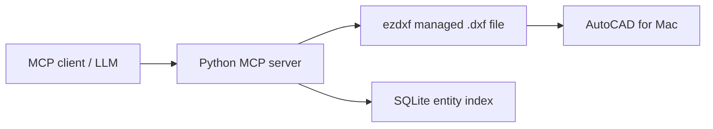

# macOS Backend Architecture

## Why This Fork Uses DXF

The upstream server sends ActiveX/COM calls through `win32com` to a running
AutoCAD instance. AutoCAD for Mac does not expose Microsoft's ActiveX
Automation API, so that design cannot run natively on macOS.

Autodesk supports AutoLISP and ObjectARX on Mac, but an MCP process cannot use
the Windows COM object model to attach to an active drawing. This version uses
the portable exchange point already understood by AutoCAD: a DXF document.

## Data Flow

`dxf_backend.py` owns document operations and entity handles. `server.py`
exposes those operations as MCP tools. Every modification is saved to the
selected DXF, making operations deterministic and testable without driving the
AutoCAD user interface.

## Intentional Difference From Windows

The server does not inspect the unsaved contents of an already-open DWG and
does not make an entity visibly selected in an existing AutoCAD window.
`highlight_*` applies a DXF color index; opening or reloading the output in
AutoCAD displays the result. Use `open_in_autocad` to launch the managed file.

## Autodesk References

- [AutoLISP introduction for Mac and ActiveX limitation](https://help.autodesk.com/cloudhelp/2025/ENU/AutoCAD-MAC-AutoLisp/files/GUID-A0E9D801-8BE9-4BF1-85E8-3807E15F3B71.htm)
- [AutoCAD 2026 for Mac developer documentation](https://help.autodesk.com/view/OARXMAC/2026/ENU/)
